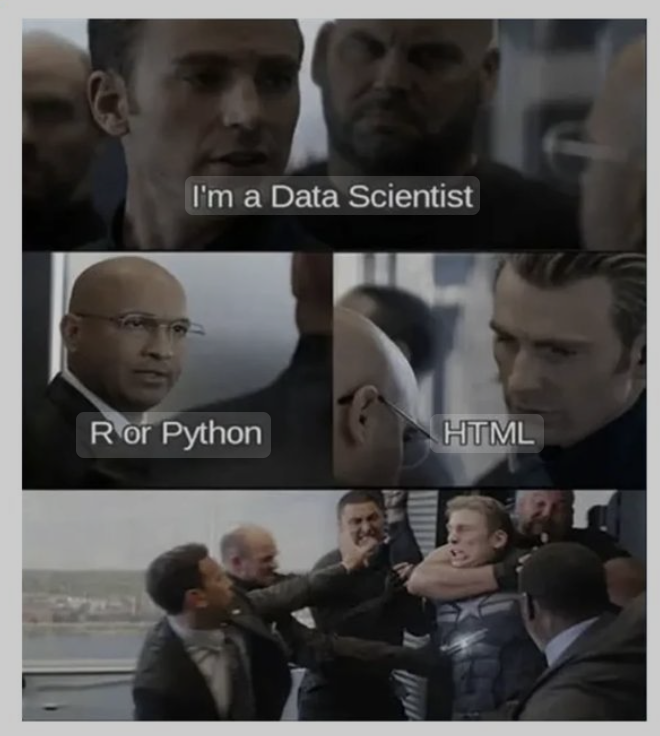

# This is Lanlan's hw4 website

This website is This is a website that showcases the results of assignments from [P8105 Homework4](https://p8105.com/homework_4.html)

I am struggling to make websites today...Learn more about this site [here](about.html)

I would also be glad if you also want to know about [me](resume.html) :)

To show the flexdashboard I made from [instacart](https://p8105.com/dataset_instacart.html) dataset loaded from `p8105.datasets` package. Check out [this page](plots.html) for details, and [here](plotly_plots) for a final dashboard check.

